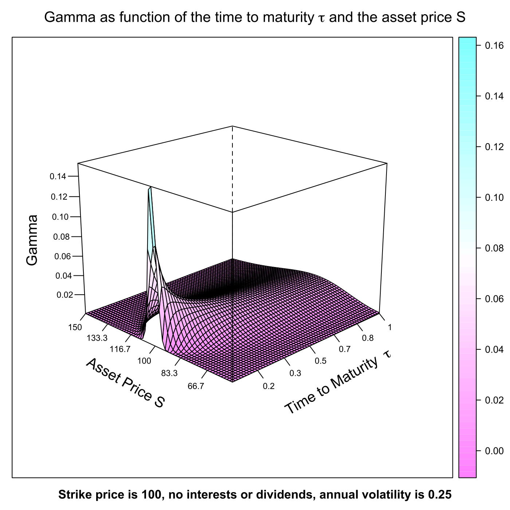

[](http://quantlet.de/index.php?p=info)

## [](http://quantlet.de/) **SFEgamma** [](http://quantlet.de/d3/ia)

```yaml
Name of QuantLet: SFEgamma

Published in: Statistics of Financial Markets

Description: 'Plots the Gamma of a call option as a function of the time to maturity and the asset
price.'

Keywords: asset, black-scholes, call, european-option, financial, graphical representation, greeks,
option, option-price, plot

See also: SFEvanna, SFEvolga, SFEdelta, SFEvega, SFEtheta, SFEspeed, SFEcharmcall, SFEcolor,
SFEultima, SFEvomma, SFEzomma, SFEdvegadtime

Author: Wolfgang K. Haerdle

Submitted: Mon, November 24 2014 by Awdesch Melzer

Example: 'For given [lower, upper] bound of Asset price S like [50,150] and [lower, upper] bound of
time to maturity tau like [0.01, 1] a plot of the Gamma of a call option is produced.'
```




```r

# clear variables and close windows
rm(list = ls(all = TRUE))
graphics.off()

# install and load packages
libraries = c("lattice")
lapply(libraries, function(x) if (!(x %in% installed.packages())) {
install.packages(x)
})
lapply(libraries, library, quietly = TRUE, character.only = TRUE)

# parameter settings
S_min   = 50          # lower bound of Asset Price
S_max   = 150         # upper bound of Asset Price 
tau_min = 0.01        # lower bound of Time to Maturity
tau_max = 1           # upper bound of Time to Maturity
K       = 100         # exercise price
r       = 0           # riskfree interest rate                  
sig     = 0.25        # volatility               
d       = 0           # dividend rate                  
b       = r - d       # cost of carry       
steps   = 60          # steps 

tau = seq(tau_min, tau_max, by = (tau_max - tau_min)/(steps - 1))
S   = seq(S_max, S_min, by = -(S_max - S_min)/(steps - 1))

gamma = function(tau, S, K, r, d, sig) {
    d1 = (log(S/K) + (r - d + sig^2/2) * tau)/(sig * sqrt(tau))
    return(dnorm(d1)/(S * (sig * sqrt(tau))))
}

mesh = outer(tau, sort(S), gamma, K = K, r = r, d = d, sig = sig)

# Plot
wireframe(mesh, drape = T, main = expression(paste("Gamma as function of the time to maturity ", 
    tau, " and the asset price S")), aspect = c(1, 0.75), sub = "Strike price is 100, no interests or dividends, annual volatility is 0.25", 
    scales = list(arrows = FALSE, col = "black", distance = 1, tick.number = 8, 
        cex = 0.7, x = list(labels = round(seq(tau_min, tau_max, length = 7), 1)), 
        y = list(labels = round(seq(S_min, S_max, length = 7), 1))), xlab = list(expression(paste("Time to Maturity  ", 
        tau)), rot = 30, cex = 1.2), ylab = list("Asset Price S", rot = -30, cex = 1.2), 
    zlab = list("Gamma", rot = 90, cex = 1.2), screen = list(z = 45, x = -70))

```
