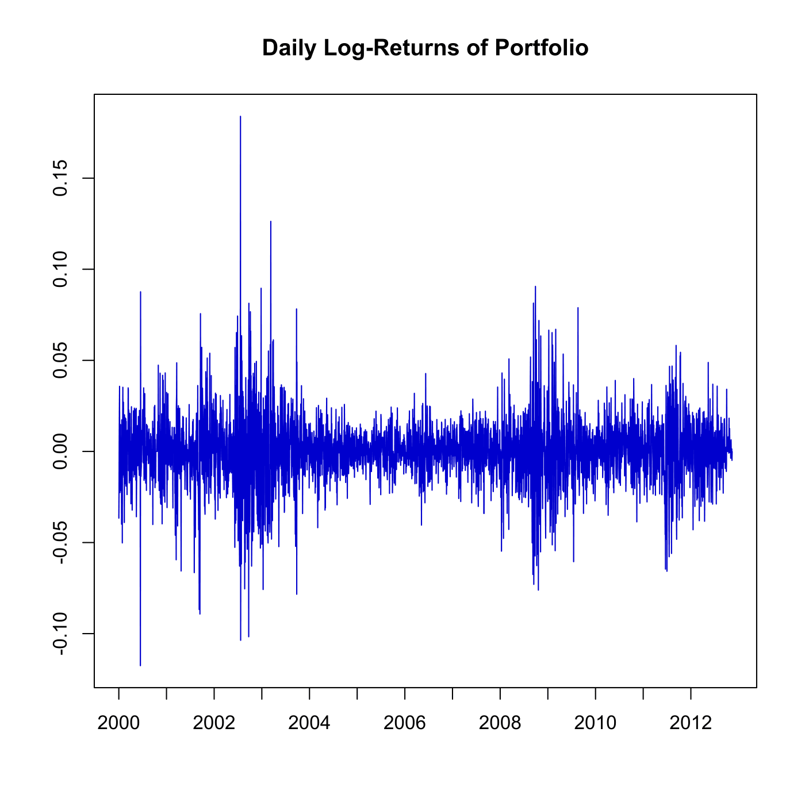

[](http://quantlet.de/index.php?p=info)

## [](http://quantlet.de/) **SFEportlogreturns** [](http://quantlet.de/d3/ia)

```yaml
Name of QuantLet: SFEportlogreturns

Published in: Statistics of Financial Markets

Description: 'Computes and plots the variance efficient portfolio of Bayer, BMW, Siemens and
Volkswagen log-returns for the period 1 January 2000 - 31 December 2012.'

Keywords: asset, data visualization, dax, financial, graphical representation, plot, portfolio,
returns, log-returns, stock-price

See also: SFEportfolio, SFEdenport, SFEclose, SFEtailGEV_pp, SFEtailGEV_qq, SFEtailGPareto_pp,
SFEtailGPareto_qq

Author: Awdesch Melzer

Submitted: Fri, November 29 2013 by Awdesch Melzer

Datafiles: BAYER_close_0012.dat, BMW_close_0012.dat, SIEMENS_close_0012.dat, VW_close_0012.dat
```




```r

# clear variables and close windows
rm(list = ls(all = TRUE))
graphics.off()

# load data
x1 = read.table("BAYER_close_0012.dat")
x2 = read.table("BMW_close_0012.dat")
x3 = read.table("SIEMENS_close_0012.dat")
x4 = read.table("VW_close_0012.dat")

r1 = diff(as.matrix(log(x1)))
r2 = diff(as.matrix(log(x2)))
r3 = diff(as.matrix(log(x3)))
r4 = diff(as.matrix(log(x4)))

# Variance efficient portfolio
portfolio = cbind(r1, r2, r3, r4)
opti = solve(cov(portfolio)) %*% c(1, 1, 1, 1)
opti = opti/sum(opti)
returns2 = as.matrix(portfolio) %*% opti

# Summary routine
summarize = function(x) {
    Minimum = apply(x, 2, min)
    Maximum = apply(x, 2, max)
    Mean = apply(x, 2, mean)
    Median = apply(x, 2, median)
    Std.Error = apply(x, 2, sd)
    table = cbind(Minimum, Maximum, Mean, Median, Std.Error)
    print(table)
}

# summary
tabelle = cbind(r1, r2, r3, r4, returns2)
colnames(tabelle) = c("Bayer", "BMW", "Siemens", "Volkswagen", "Portfolio")

# plot
xt = summarize(tabelle)
t  = seq(1, length(returns2), by = 261)
plot(returns2, col = "blue3", type = "l", ylab = "", xlab = "", xaxt = "n")
title("Daily Log-Returns of Portfolio")
axis(1, at = t, labels = seq(2000, 2012, 1))
```
