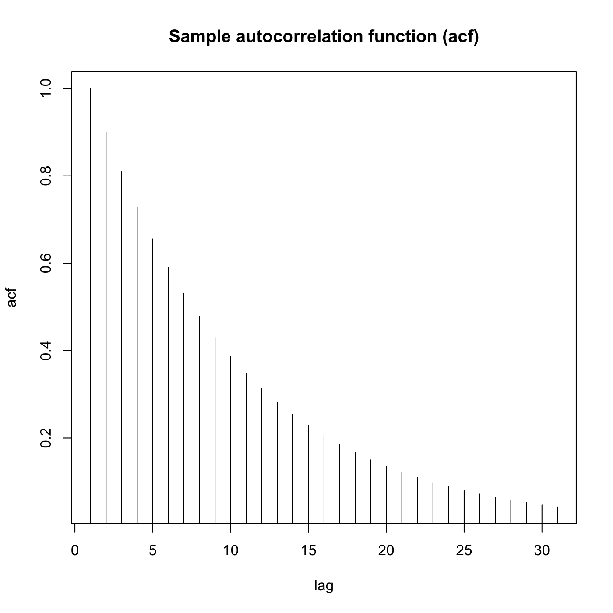

[](http://quantlet.de/index.php?p=info)

## [](http://quantlet.de/) **SFEacfar1** [](http://quantlet.de/d3/ia)

```yaml
Name of QuantLet: SFEacfar1

Published in: Statistics of Financial Markets

Description: 'Plots the autocorrelation function of an AR(1) (autoregressive) process.'

Keywords: acf, autocorrelation, autoregressive, discrete, graphical representation, linear, plot,
process, simulation, stationary, stochastic, stochastic-process, time-series

See also: SFEacfar2, SFEacfma1, SFEacfma2, SFEpacfar2, SFEpacfma2, SFEfgnacf

Author: Joanna Tomanek

Submitted: Fri, June 13 2014 by Felix Jung

Input:
- a : alpha value
- lag : lag value

Example:
- a=0.9, lag=30
- a=-0.9, lag=30
```




```r

# clear variables and close windows
rm(list = ls(all = TRUE))
graphics.off()

# parameter settings
lag = "30"  # lag value
a   = "0.9"  # value of alpha_1

# Input alpha_1
message = "      give alpha"
default = a
a = winDialogString(message, default)
a = type.convert(a, na.strings = "NA", as.is = FALSE, dec = ".")

# Input lag value
message = "      give lag"
default = lag
lag = winDialogString(message, default)
lag = type.convert(lag, na.strings = "NA", as.is = FALSE, dec = ".")

# Plot
plot(ARMAacf(ar = a, ma = numeric(0), lag.max = lag, pacf = FALSE), type = "h", 
    xlab = "lag", ylab = "acf")
title("Sample autocorrelation function (acf)")
```
